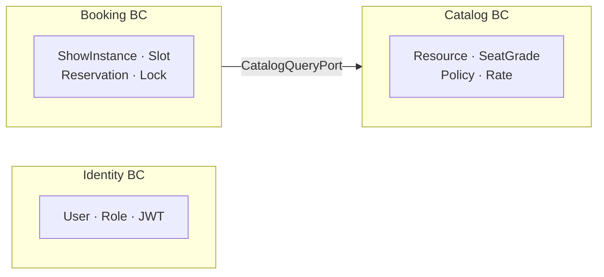
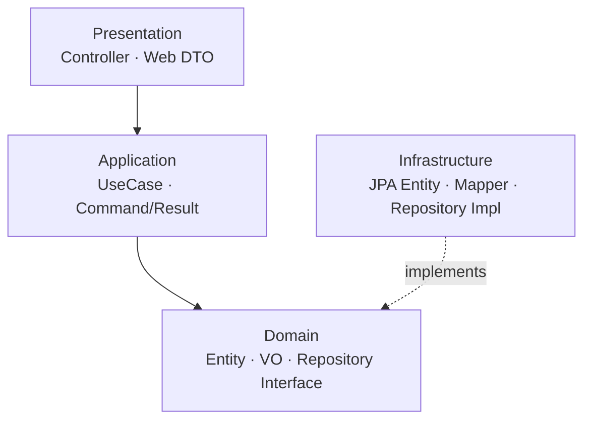
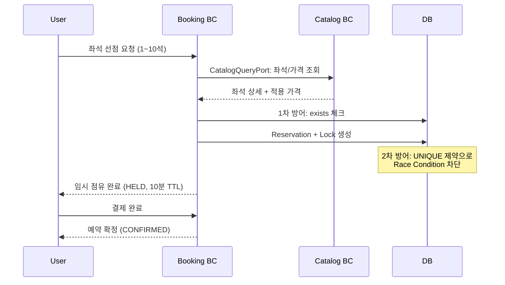

# Reservation System

공연/이벤트 좌석 예약 시스템 — Spring Boot 기반 백엔드

## 프로젝트 소개

인기 공연의 티켓 오픈 시 수천~수만 명이 동시에 접속하는 상황에서, **좌석 단위의 데이터 무결성**을 보장하는 예약 시스템입니다.

- **동시성 제어**: 같은 좌석에 대한 동시 예약 시도를 DB + Application 레벨에서 완벽 차단
- **계층적 리소스 관리**: 공연장 → 층 → 열 → 좌석의 트리 구조를 Closure Table로 효율 쿼리
- **동적 가격 정책**: 좌석 등급, 시간대, 요일, 프로모션에 따른 우선순위 기반 가격 적용
- **도메인 경계 분리**: DDD 기반 Bounded Context로 명확한 책임 분리

## 기술 스택

| 분류 | 기술 |
|------|------|
| Language | Java 21 |
| Framework | Spring Boot 4.0.1 |
| Persistence | Spring Data JPA, Flyway |
| Security | Spring Security, JWT (jjwt) |
| Database | MySQL 8.0+ |
| API Docs | Swagger/OpenAPI (springdoc) |
| Build | Maven |
| Test | JUnit 5, Mockito, H2 |
| Code Quality | JaCoCo, SonarQube, google-java-format |

## 아키텍처

### Bounded Context 구조



Common 모듈(Security, Config, Error Handling)이 전체 애플리케이션에 공통 기능을 제공합니다.

### 계층 구조 (각 BC 공통)



- **Domain**: 순수 Java, 외부 의존성 없음
- **Infrastructure**: Domain 인터페이스를 구현 (의존성 역전)
- **BC 간 통신**: Outbound Port 인터페이스로 격리 (직접 참조 금지)

### 예약 프로세스



## 핵심 기술 구현

| 기능 | 구현 방식 | 핵심 포인트 |
|------|----------|------------|
| **인증/인가** | JWT (Access + Refresh Token) | Token Rotation, Role Hierarchy (`SUPER_ADMIN > ADMIN > USER`) |
| **계층적 리소스** | Closure Table 패턴 | 조상-자손 관계를 별도 테이블에 저장, O(1) JOIN 계층 쿼리 |
| **동적 가격** | 우선순위 기반 정책 매칭 | `PROMOTION > OVERRIDE > BASE`, SQL Projection으로 적용 가격 결정 |
| **회차 관리** | ShowInstance + ResourceSlot | 회차 오픈 시 좌석별 슬롯 자동 생성, 상태 전이 (`SCHEDULED → OPEN → CLOSED`) |
| **동시성 제어** | 2단계 방어 | Application `exists` 체크 + DB `UNIQUE` 제약, Aggregate Root로 트랜잭션 일관성 |
| **BC 간 통신** | Outbound Port 패턴 | `CatalogQueryPort` 인터페이스로 BC 격리, Infrastructure에서 연결 |

## 실행 방법

### 사전 요구사항

- Java 21
- MySQL 8.0+
- Maven 3.8+

### 환경 변수 설정

```bash
export SPRING_RSV_DB_URL=jdbc:mysql://localhost:3306/reservation?useSSL=false&serverTimezone=UTC
export SPRING_RSV_DB_USERNAME=your_db_username
export SPRING_RSV_DB_PASSWORD=your_db_password
export SPRING_RSV_JWT_SECRET=your_jwt_secret_base64_encoded
```

### 빌드 및 실행

```bash
./mvnw clean package         # 빌드
./mvnw spring-boot:run       # 실행
./mvnw test                  # 테스트 + 커버리지 리포트
```

> 서버는 UTC 시간대로 동작합니다. API 문서: `http://localhost:8080/swagger-ui/index.html`

## 향후 계획

- [x] **좌석 선점 프로세스**: 좌석 임시 점유(HELD) + 10분 TTL + Reservation Aggregate Root
- [x] **동시성 제어**: Application 레벨 exists 체크 + DB UNIQUE 제약 이중 방어
- [ ] **예약 확정/취소**: 결제 후 확정(CONFIRMED), 예약 취소(CANCELLED) 워크플로우
- [ ] **만료 락 자동 해제**: TTL 기반 임시 잠금 만료 배치 처리
- [ ] **이벤트 기반 아키텍처**: Spring Events를 활용한 BC 간 비동기 통신

## 상세 문서

| 문서 | 내용 |
|------|------|
| [ARCHITECTURE.md](docs/ARCHITECTURE.md) | 아키텍처 상세, 프로젝트 구조, 의존성 방향, Port 패턴 |
| [FEATURES.md](docs/FEATURES.md) | 전체 기능 목록 + 도메인별 상세 문서 |
| [DATABASE_SCHEMA.md](docs/DATABASE_SCHEMA.md) | DB 스키마, 테이블 관계, 인덱스 전략 |
| [TESTING_GUIDE.md](docs/TESTING_GUIDE.md) | 테스트 전략, 커버리지 기준, 레이어별 방식 |
| [CODING_CONVENTIONS.md](docs/CODING_CONVENTIONS.md) | 코딩 컨벤션, 네이밍, API 설계 |
